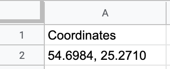
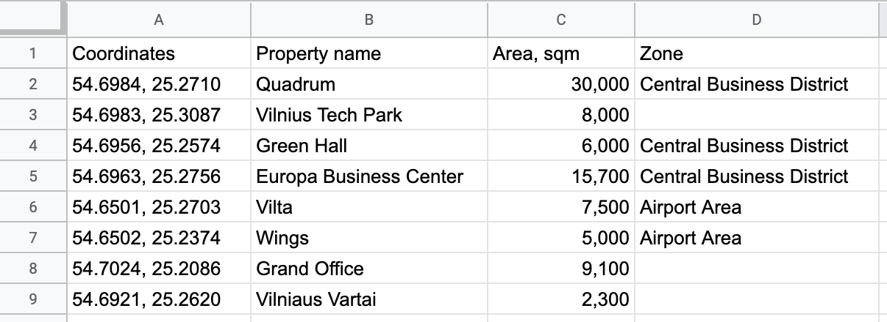

# Zonal Maps
> https://evaldasstu.github.io/zonalmaps

## Overview

Zonal Maps creates embeddable maps with location markers using data from [Google Sheets](https://www.google.com/sheets/about/) spreadsheets. It has a powerful **zoning feature** which allows assigning object sets to geographical areas and automatically displays boundaries of such zones.

To do: add zoning visual?

This project was developed to simplify a process of creating commercial real estate property maps and to provide an easy to learn and convenient way of content update.

Zonal Maps is built with [React](https://reactjs.org) and uses map data provided by [OpenStreetMap contributors](https://www.openstreetmap.org/copyright).

To do: add visuals.

## Prepare a spreadsheet

[Create a spreadsheet](https://sheet.new/) on Google Sheets. To do: add more.

### Spreadsheet specification

The simplest possible spreadsheet that could be understood by Zonal Maps would look like this:

Pasting a link to this spreadhsheat into [Get embed code](https://evaldasstu.github.io/zonalmaps/embed) form would result a map centered around a single marked point. `Coordinates` is the only required *attribute* in the spreadsheet, but there can be more of them.

Attributes can be freely named, except `Coordinates` and `Zone`, which are [*special attributes*.](#special-attributes). All attributes must reside in spreadsheet's Row 1. Each subsequent row represents a location displayed on the map. There is no need for a list numbering attribute, as numbers are assigned automatically.

This is an example of a bit more complex spreadsheet, which includes [`Zone`](#zone), another special attribute:

If there is a need for embedding maps into multilingual websites, additional sheet, called `Translations` will have to be created in the same spreadsheet. In this case, the main sheet will have to be named `Data`. Otherwise, it can keep *Sheet 1* or any other name. More on translating, check [Multilingual embeds](#multilingual-embeds) below.

#### Special attributes

Special attribute names are presented in uppercase form to keep consistency with custom attributes, however they are case–insensitive. Special attributes are not displayed in location lists. 

| Special attribute | Required | Example value             |
|:------------------|:---------|:--------------------------|
| `Coordinates`     | +        | `54.698415, 25.271016`    | 
| `Zone`            |          | Central Business District |

##### `Coordinates`

Geographical coordinates are expected to be provided in Decimal degrees (DD) format. First number is for latitude, second is for longitude. For the example above, numbers for the example value have been conveniently copied from Google Maps, however four decimal places (`54.6984, 25.2710`) would suffice for most practical purposes. Space between latitude and longitude is optional, numbers must be comma–separated.

##### `Zone`

This attribute is used to assign objects to groups for displaying boundaries around geographic areas.

To do: add more.

#### Spreadsheet's sheets

| Sheet name     | Required | Notes                                              |
|:---------------|:---------|:---------------------------------------------------|
| `Data`         | +        | Can have any name when no other sheets are present | 
| `Translations` |          | See [Multilingual embeds](#multilingual-embeds)    |

### Share the spreadsheet

In Google Sheets, choose **File** > **Share**, select **Copy link** and change **Restricted** to **Anyone with the link** to allow the spreadsheet to be publicly readable. The spreadsheet will have to remain public for the embed to work.

## Get embed code

Navigate to [Get Embed Code](https://evaldasstu.github.io/zonalmaps/embed) to access the embed code generator. To do: add more on pasting the link and something more.

It should be relatively easy to use such embed code by adding it if you have access to website's HTML code. `
`

### Language

By default, Zonal Maps outputs a user interface in English. However, this can be changed by choosing **Customize embed** and selecting **Language**.

See [Multilingual embeds](#multilingual-embeds) for details.

### Display location list

By default, Zonal Maps displays a location list as a sortable table below the map. If this functionality is not needed, list display can be turned off by choosing **Customize embed** and unchecking **Display location list**.

## Use embed code

### Embedding in WordPress

To add an embed to a [WordPress](https://wordpress.org) website using Block Editor (default since version 5.0), add a **Custom HTML** block and paste the embed code.

When using the Classic Editor or pre–Gutenberg WordPress, switch to **Text** tab of the editor and paste the embed code.

## Multilingual embeds

If there is a need to offer map versions in more than one language, it is possible to provide attribute translations in the same spreadsheet. In such case, the main sheet of the spreadsheet containing the list of locations will have to be named `Data`, while another sheet named `Translations` will have to be created.

Open [this spreadsheet](https://docs.google.com/spreadsheets/d/1hEG0yonVRlBs50UNzGc2uiv6pBJyzY1mQczfINHwnEM/edit?usp=sharing), which is the source for [Example 1](https://evaldasstu.github.io/zonalmaps/example/1) and check `Translations` sheet to see how multilingual map versions can be implemented.

When [Get embed code](https://evaldasstu.github.io/zonalmaps/embed) form is provided with a link to a spreadsheet containing multilingual attributes, **Language** option gets enabled in **Customize embed** setting panel. All languages that are set in the spreadsheet appear in the dropdown menu.

To do: more on locale and numbers?

## Browser support

| Desktop              | Mobile             |
|:---------------------|:-------------------|
| Chrome               | Chrome             |
| Firefox              | Firefox            |
| Safari 5+ (Mac only) | Safari 7+          |
| Opera 12+            | Android Browser 5+ |
| IE 10+               |                    |
| Edge                 |                    |

## Examples

* [Link to Example Map 1](https://evaldasstu.github.io/zonalmaps/example/1)
* [Link to Example Map 2](https://evaldasstu.github.io/zonalmaps/example/2)
* [Link to Example Map 3](https://evaldasstu.github.io/zonalmaps/example/3)

## Development

Project source code is stored in a public GitHub repository at https://github.com/evaldasstu/zonalmaps.

This project is based on Create React App. Standard `npm start`, `npm test`, `npm run build` scripts are available in a Node.js development environment. More on this [here](https://create-react-app.dev/docs/available-scripts).

To do: add more on integration, branches, GitHub's encrypted secrets, Google Sheets API code.

### Deployment

Project's `package.json` is configured for deployment to GitHub Pages using `npm run deploy` script.

## Acknowledgements

Zonal Maps runs using:

* [React](https://reactjs.org)
* [OpenStreetMap](https://openstreetmap.org) via [Leaflet](https://leafletjs.com)
* [Google Sheets API](https://developers.google.com/sheets/api)

As well as with the help of [Bootstrap](https://getbootstrap.com), [Sass](https://sass-lang.com), [react-spring](https://www.react-spring.io/), [Jest](https://jestjs.io) and other packages. For full list, check the [dependency graph](https://github.com/evaldasstu/zonalmaps/network/dependencies).

## License

Zonal Maps is open source software licensed under the MIT license.  
Copyright © 2020 Evaldas Stulgaitis
